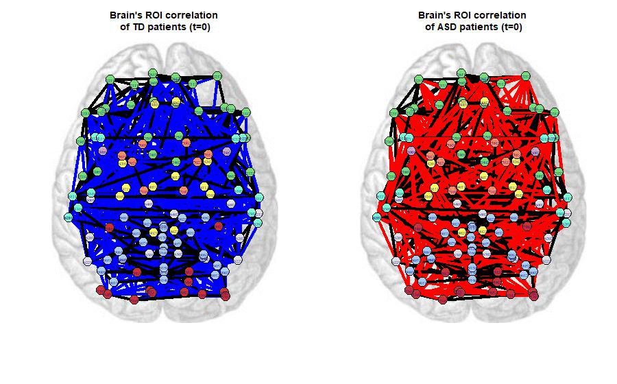

```{r setup, include=FALSE}
if (requireNamespace("thematic")) 
  thematic::thematic_rmd(font = "auto")
```

```{r package}

suppressMessages(library(jpeg))
suppressMessages(library(ppcor))
suppressMessages(library(igraph))


```

## Purpose & Statistical tools used

The goal of the project is to analyze differences in fMRI (functional magnetic resonance imaging) between subjects with autism spectrum disorder (ASD) and Typically Developed (TD) subjects in order to highlight the possible difference that can be analyzed with more focus on medical study.
In order to reach this goal we used statistical tools as Hypothesis test based on asymptotic confidence intervals for the Pearson's correlation coefficient $\rho$ and partial correlation coefficient $\rho^{(P)}$.
Differences between the two approaches will be shown later

## Dataset
```{r dataset}

load('data/hw2_data.RData')
load('data/coordinates.RData')

```

The dataset we used for the sake of this project is ABIDE (Autism Brain Imaging Data Exchange); a collection of brain imaging data and clinical information from individuals with autism spectrum disorder (ASD) and typically developing (TD) controls.

The dataset consists a of structural and functional fMRI data from over 12 individuals with ASD and 12 TD controls.

For each subject, we have $n =145$ fMRI results for each of the $D = 116$ cortical regions.

Brief explanation (Without being an expert) of what ABIDE dataset contains:

-   fMRI measures brain activity by detecting changes in blood flow.

The eight cortical regions in the ABIDE dataset are:

-   <font color="#77DD77"> Frontal lobe</font>: is involved in decision-making, planning, and problem-solving.

-   <font color="#C8A2C8"> Insula lobe </font>: is involved sensory experience and emotional valence.

-   <font color="#FFFF66"> Limbic system </font>: is involved in behavioural and emotional responses.

-   <font color= "#CB3234"> Occipital lobe </font>: is involved in visual perception, including color, form, and motion.

-   <font color="#E1E1E2"> Parietal lobe </font>: is responsible for sensory perception and integration, like taste, hearing, sight, touch, and smell.

-   <font color="#ff8c69"> SCGM </font>: is involved in process information.

-   <font color="#7fffd4"> Temporal lobe </font>: is involved in the retention of visual memory, language comprehension, and emotion association.

-   <font color="#ABCDEF"> Cerebellum </font>: is involved in muscle control, including balance and movement.

[TODO] References

## Pre-processed

Since data were taken in different labs, it's worth seeing and removing the lab-specific effect. For instance, we can have a look at the distribution of fMRI at the same cortical region for two difference subjects in the same group but taken in a different laboratory.

```{r data - preproocessing 1 , warning = FALSE}

sub_1 <- td_sel$caltech_0051487$`2001`
sub_2 <- td_sel$trinity_0050259$`2001`
par(mfrow = c( 1, 2 ))
hist(sub_1 , main = "Histogram of fMRI in the 2001 area \n subject 1",
     col = "#4682b4", border = "white" , freq = T , xlab = "fMRI result"
  
)

box()

hist(sub_2 , main = "Histogram of fMRI in the 2001 area \n subject 2",
     col= "#4682b4", border = "white" , freq = T , xlab = "fMRI result"
)

box()

```

To remove the subject-specific effect we subtract the 116 time series arithmetic means and divide by their corresponding across time standard deviations.

```{r data - preproocessing 2  }
scale_datasets_list <- function(ls){
  scaled_list <- list()
  names <- names(ls)
  for(i in 1:length(ls)){
    
    #### Scaling by column.
    patient <- data.frame(apply(ls[[i]], 2, scale))
    colnames(patient) <- colnames(ls[[i]])
    scaled_list[[names[i]]] <-patient
  }
  return(scaled_list)
}

td_sel_scale <- scale_datasets_list(td_sel)
asd_sel_scale <- scale_datasets_list(asd_sel)
```

## Pool Together

To achieve the goal of enhance the separation between ASD and TD subjects, we pool the data within each group, by taking a statistical summary across subject on a per-time and per ROI data.
For the continuation we take two different statistical summary.

- Median : As a robust position index insensitive to changes in scale that the  measurements can have

- Standard deviation :as a relevant statistics in order to study ROI co-variation in variability.
 
We assumed within group double independence (across time and subjects), we will not consider the time dependency and so we treat the data as $i.i.d.$.

```{r data pool together }
#### Mean by cell given list of datasets
cells_value_array <- function(ls, i, j){
  cells_value <- c()
  for(patient in ls){
    cells_value <- c(cells_value, patient[i,j])
  }
  return(cells_value)
}


#### Choose metric =c('mean', 'median', 'sd')
summary_dataset <- function(ls, metric='mean'){
  if(metric=='mean'){fun <- mean}
  if(metric=='median'){fun <- median}
  if(metric=='sd'){fun <- sd}
  
  n <- nrow(ls[[1]])
  m <- ncol(ls[[1]])
  mean_data <- matrix(rep(NA,n*m), n, m)
  for(i in 1:n){
    for(j in 1:m){
      mean_data[i,j] <- fun(cells_value_array(ls, i, j))
    }
  }
  data_frame <-data.frame(mean_data)
  colnames(data_frame) <- colnames(ls[[1]])
  return(data_frame)
}


TD <- summary_dataset(td_sel_scale, metric='median')
ASD <- summary_dataset(asd_sel_scale, metric='median')


```

As a consequence of this approach, we end up with two $116 \times 116$ matrices, that represent the correlations between all the cortical regions for the two groups.

Correlations might be used to examine the relationship between brain fMRI data. By calculating correlations between these regions, we can determine whether there is a relationship and how strong it is. It is a way of understanding how different regions of the brain are connected and how they influence each other's activity. If two brain regions consistently show strong positive correlations, it means that their activity tends to increase or decrease together, it might suggest that they are strongly connected and influence each other's activity.

First, we can have a look at the empirical distribution of the Pearson correlation coefficients within the groups. The distribution of correlations can provide insights into brain function and can be helpful to understand how different brain regions contribute to various cognitive processes.

```{r histograms correlations coefficient, warning = FALSE}
corr_distr_fun <- function(data_1 , data_2 , metric){
  pTD  <-  summary_dataset(data_1 , metric = metric)
  pASD <-  summary_dataset( data_2, metric = metric)
  par(mfrow = c(1,2))
  hist(cor(pTD) ,
       main = "Histograms of correlation \n coefficients for TD subject",
       xlab = expression(hat(rho)) , 
       border = "white" , 
       col = "#E52B50"  , freq = FALSE )
  box()
  hist(cor(pASD) ,
       main = "Histograms of correlation\n coefficients for ASD subject",
       xlab = expression(hat(rho)) , 
       border = "white" , 
       col = "#E52B50", freq = FALSE )
  box()
  par(mfrow = c(1,1))
}

corr_distr_fun(td_sel_scale , asd_sel_scale , metric = "median")
corr_distr_fun(td_sel_scale , asd_sel_scale , metric = "sd")

```

For evaluating dependency between cortical regions we have used the association graph.

For each pair {j,k} of cortical regions we tested at a confidence level set to $\alpha = 0.05$if they are uncorrelated:

```{=tex}
\begin{cases}
  H_{0} :\hat{\rho_{j,k}}  = 0  \\
  H_{1} :\hat{\rho_{j,k}} \neq 0\\
\end{cases}
```
To test so, we compute for each pair {j,k} the confidence intervals, rejecting the null Hypothesis if the intervals does not intersect with the value 0.

Generically, having a threshold t , we can require a as we like strong correlation between the ares placing an edge between feature $j$ and feature $k$
whenever [−t, +t] ∩ Cj,k (α) = ∅ (the empty-set).

### Choice of the threshold t


Since we care only about the strongness of the correlation between two areas we consider to slice the threshold t over the absolute values of percentiles of the distribution of $\rho$.

```{r quantile distributions , warning = FALSE}
quantile_distr_func <- function(data1 , data2 , metric){
  pTD  <-  summary_dataset(data1 , metric = metric)
  pASD <-  summary_dataset(data2, metric = metric)
  q1   <-  sort(abs(cor(pTD))) 
  q2   <-  sort(abs(cor(pASD))) 
  par(mfrow = c(1,2))
  plot(q1 , main = "Quantile distribution of correlation \n  coefficient for TD subject",
       col = "#ffff66" , cex = .3)
  grid()
  plot(q2 , main = "Quantile distribution of correlation \n  coefficient for ASD subject",
       col = "#ffff66" , cex = .3)
  grid()
  par(mfrow = c(1,1))
}
quantile_distr_func(td_sel_scale , asd_sel_scale , metric = "median")
quantile_distr_func(td_sel_scale , asd_sel_scale , metric = "sd")
```


### Process to compute the Confidence intervals

To compute confidence intervals for a family of correlation coefficients, we used the Fisher's Z transformation. This method involves converting the correlation coefficients to a new scale called z-scores.

$$\hat z_{j,k} = \frac{1}{2}log\big(\frac{1 + \hat\rho_{j,k}}{1 - \hat\rho_{j,k}}\big) = artanh(\hat\rho)$$

where it is asymptotically normally distributed as a gaussian with mean $z_{j,k}$ and standard error $\frac{1}{\sqrt{N-3}}$

Once converted the correlations coefficients to z-scores, we can use the normal distribution to build confidence intervals, and then convert lower and upper bound back to the original scale by using the inverse of z-transformation.

Since we are dealing with family wise test, in order to control the probability of making at least one error we can adjust the $\alpha$ confidence level by using Bonferroni Correction. The confidence level would be divided by the number of correlations coefficient we are testing $\binom{D}{2} = \frac{116 \times 115}{2} = 6.670$.

The Bonferroni adjustment is a conservative method, meaning that it tends to make error on the side of rejecting the null hypothesis. Since \$\alpha\_{b} = \frac{\alpha}{m} = \frac{.05}{6670} = 0,00075 \$ the confidence intervals results wider, more often intersecting the interval $(-t, t)$ . It results on the conclusion of don't put edges between cortical regions where it should be.

```{r Confidence intervals }
lower_or_upper <- function(data, bound, cor_type='normal', bonferroni=TRUE){
  
  #### Setting Parameters
  n <- dim(data)[1]
  D <- dim(data)[2]
  alpha <- .05
  m <- choose(D, 2)   # Binomial coefficient
  
  #### Bonferroni Correction
  if(bonferroni == TRUE){ alpha <- alpha / m }
  
  
  #### Use "Correlation" or "Partial Correlation"
  if(cor_type == 'normal'){
    g <- 0
    corr_matrix <- cor(data) }
  if(cor_type == 'partial'){
    g <- D-2
    corr_matrix <- pcor(data) }
  
  #### Computing Fisher Z-Transform
  Z_j_k_td <- (1/2)*log((1+corr_matrix)/(1-corr_matrix))
  
  #### Confidence intervals for theta
  se <- sqrt(1/( n - g - 3))
  Log_lower <- Z_j_k_td - qnorm(1 - (alpha/2)) * se
  Log_upper <- Z_j_k_td + qnorm(1 - (alpha/2)) * se
  
  #### Confidence intervals for rho
  Lower_bound <- (exp(2*Log_lower) - 1 ) /   ((exp(2*Log_lower) + 1))
  Upper_bound <- (exp(2*Log_upper) - 1 ) /   ((exp(2*Log_upper) + 1)) 
  
  #### Remove NA (on diagonal)
  Lower_bound[is.na(Lower_bound)] = 1
  Upper_bound[is.na(Upper_bound)] = 1
  
  if(bound == 'L'){ return(Lower_bound) }
  if(bound == 'U'){ return(Upper_bound) }
}

```

By increasing the value of the threshold t we basically require a strongest correlation between the two regions.

We set the adjacency matrix as a (D x D) matrix where there is 1 if for the pair {j , k} the null hypothesis is rejected and 0 otherwise.

```{r adjecency matrix }
adj_matrix_func <- function(mat , t , bonf = TRUE){
  L <-  lower_or_upper(mat , "L", bonferroni = bonf)
  U <-  lower_or_upper(mat , "U", bonferroni = bonf )
  adj <- as.matrix(L > t | U < -t)
  return(adj)
}
```

The graph is represented by G = (V, E) where V = {V1, . . . , VD} is the vertex--set and E the edge--set.The edge--set E is as a (D × D) adjacency matrix E where E(j, k) = 1 if there is an edge between regions j and regions k and 0 otherwise.

After all we can visualize the association graph f0r the two groups slicing the value of threshold t in order to see co-activation differences.

```{r plot , warning = FALSE }
plot_graphs <- function(mat_1 , mat_2 ,t, dimensions=2 , bonferroni = TRUE){
  
  adj_mat_1 <- adj_matrix_func(mat_1, t = t, bonferroni)
  adj_mat_2 <- adj_matrix_func(mat_2, t = t, bonferroni)
  
  #Check if there are edges
  if(sum(adj_mat_1) == 116 & sum(adj_mat_2)==116){
    return('There are no edges. Try with lower value of t')
  }
  
  #### Create Graphs
  g1 <- graph.adjacency(adj_mat_1, mode = "undirected", diag = FALSE )
  g2 <- graph.adjacency(adj_mat_2, mode = "undirected", diag = FALSE )
  
  
  #### Set nodes colors based on ROIs
  colors <- c('0','#77DD77', '#C8A2C8', '#FFFF66', '#CB3234', '#E1E1E2', '#ff8c69', '#7fffd4', '#ABCDEF')
  
  for(i in 1:length(V(g1)$name)){
    V(g1)$color[i] <- colors[strtoi(substr(V(g1)$name[i],1,1))]
    V(g2)$color[i] <- colors[strtoi(substr(V(g2)$name[i],1,1))] }
  
  
  #### Change edges colors based on if they are present in both graphs or in only one
  for(i in 1:length(E(g1))){
    edge <- as_ids(E(g1)[i])
    if(edge %in% as_ids(E(g2))){E(g1)[i]$color = 'black'}
    else{E(g1)[i]$color = 'blue'} }
  
  
  for(i in 1:length(E(g2))){
    edge <- as_ids(E(g2)[i])
    if(edge %in% as_ids(E(g1))){E(g2)[i]$color = 'black'}
    else{E(g2)[i]$color = 'red'} }
  
  
  #### Import ROI coordinates
  load('data/coordinates.RData')
  coord <- aal116coordinates
  
  if(dimensions == 2){
    #### 2D Plot
    par(mfrow=c(1,2))
    layout <- matrix(c(coord$x.mni, coord$y.mni), 116,2)
    
    my_image <- readJPEG("images/brain.jpg")
    
    for(graph in list(g1,g2)){
      
      if(identical_graphs(graph, g1)){main = paste0("Brain's ROI correlation\n of TD patients (t=", t, ')')}
      if(identical_graphs(graph, g2)){main = paste0("Brain's ROI correlation\n of ASD patients (t=", t, ')')}
      
      plot(0,0, type='n', xlim=c(-1.2, 1.2), ylim=c(-1.2, 1.2), axes=F, main=main, xlab='', ylab='')
      
      rasterImage(my_image, xleft=-1.2, xright=1.2, ybottom=-1.2, ytop=1.3)
      
      plot(graph, vertex.size=10, vertex.label.cex=.5, vertex.color=V(graph)$color, vertex.shape='circle',
           edge.width=4, edge.color=E(graph)$color, vertex.label.col = 'black',
           layout=layout, add=T) }}
  
  
  if(dimensions == 3){
    #### 3D Plot
    layout <- matrix(c(coord$x.mni, coord$y.mni, coord$z.mni), 116,3)
    
    for(graph in list(g1, g2)){
      rglplot(graph,
              vertex.size=7, vertex.label.cex=.5, vertex.color=V(graph)$color,
              edge.width=4, edge.color=E(graph)$color,
              layout=layout, main= "ciao3d") }}
}


plot_graphs(TD, ASD ,t = .3 , dimensions=2)

#plot_graphs(TD, ASD , t = .3 , dimensions = 2 , bonferroni = FALSE)

```

::: {align="center"}

:::

### Explanation of the plots

The plots rappresents the two graphs one for each group where:

-   each node rapprsents a cortical region of the brain, the color of the nodes identify one of the eight main areas (previously explained ) it belongs.

-   each edge rappresents a strongest than the setted threshold t linear correlation between the two ares, the color of the edge has the following meaning:

    black: if both the two graph have the edge in common.

    blue: if only the TD graph has the edge.

    red: if only the ASD graph has the edge.

## Statistical properties:

All the plots are built using the Person's correlation coefficient as the association measure.

The first pair of plots are built according to the Bonferroni family-wise adjustment while the second one are built skipping the connection. As we could expect the unadjusted one ( since the test is based on wiser confidence intervals ) has definetely more edges than the other.

```{r CIS PLOTS ,  warning = FALSE}

Ls <- sort(lower_or_upper(TD , "L"))
xs <- seq(from = 0 , to = length(Ls) , by = 1)
Us <- sort(lower_or_upper(TD , "U") )
Ls_n <-sort(lower_or_upper(TD , "L" , bonferroni = F))  
US_n <- sort(lower_or_upper(TD , "U" , bonferroni = F))  


plot(Ls, col = "white" , main = "Asyntotic confidence intervals of rho \n 
     with bonferroni  adjustment and without", 
     xlab = "" , ylab = "Lower and Upper Bound")
points(Us, , col = "white")
segments(x0 = xs , y0 = Ls , x1 = xs , y1 = Us, , col = "lightblue")
segments(x0 = xs , y0 = Ls_n , x1 = xs , y1 = US_n, , col = "#FFFF66")
grid()
points(sort(cor(TD)), col = "#CB3234", cex =  .3)
legend("topleft" , c("With Bonferroni correction" , "Without Bonferroni correction") , col = c("lightblue" , "#FFFF66") , lty = 1 , lwd = 2 , bty = "n" )


```


## Analysis

Following the result of what happens varying the threshold t from small to large value of \$\\alpha\$:

-   edges between cortical regions in <font color= "#CB3234"> Occipital lobe </font> are the most resilient in both the two graphs. It suggests that there are no statistical difference in order to highlight problems riguardanti visual perception between ASD and TD subjects.

-   edges between cortical regions in <font color="#7fffd4"> Temporal lobe </font> are resilient in both the two groups. It suggest that there are no statistical difference in order to highlight problems riguardanti visual memory, language comprehension, and emotion association that can be caused by authism.

-   edges between cortical regions in <font color="#77DD77"> Frontal lobe</font> are more resilient for the TD graph than the ASD one. It suggest that there are statistical difference between groups in this specif area that can be sintomo di disturbi riguardanti problem solving and and executive functions.

Besides a lot of connection are effectively between areas corresponding to different regions.
Generically differences between two groups are in the structure of the connections, ,meaning that there is no a specific brain problem that is associated with autism. The main result is the differences in the association struuture of a certain region as the Frontal lobe, which is involved in problem solving and social processing.
However,the brain changes associated with autism can vary from people and a sample of twelve people per group may not catch all the actual differences that exist.
The aim of the study is to suggest possible specific problem releated with autism, to do more focus research to fully understand the underlying brain abnormalities in this disorder.


## Analysis using partial correlation

Partial correlation is a measure of the linear association between two variables while controlling for the effects of one or more others.

Partial correlation is a measure of the strength and direction of the relationship between two variables, taking into account the effects of one or more other variables. It is useful for understanding the relationship between two variables when there are other variables that might be influencing that relationship.

[TODO] Highlight differences in confidence intervals between the two association measure.
												


			
		

	
